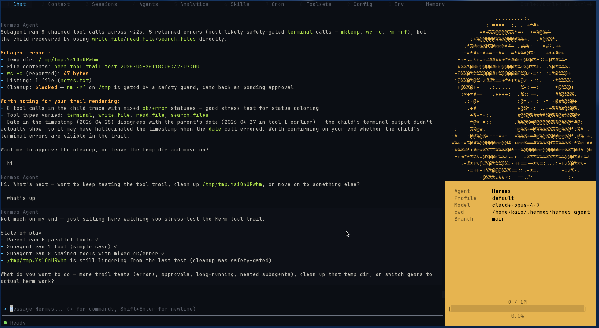

# Herm - Dashboard TUI for Hermes



> **herm** /hɜːm/ _noun_ : a sculptured head of Hermes on a square stone pillar, used in ancient Greece as a boundary marker at crossroads.

Herm is a tabbed, mouse-aware TUI built with [OpenTUI](https://github.com/anomalyco/opentui) (React renderer) and [Bun](https://bun.sh/). It talks to the same gateway `hermes` cli uses.

## What it does

- **Chat** with streaming, markdown, code blocks, diff rendering, tool-call expansion, and an animated ASCII avatar
- **Tabs** for sessions, context, agents, skills, cron, toolsets, memory, env, config
- **Command palette** (`Ctrl+K`), **slash popover**, **@-refs** for file/diff context
- **Fully rebindable keys** (`/keys`) and theme picker

## Install

Herm needs a working [Hermes Agent](https://github.com/NousResearch/hermes-agent) install. 

```bash
git clone https://github.com/liftaris/herm.git
cd herm
bun install
bun run src/index.tsx
```

<!-- bunx segfaults. commenting until this is fixed
 Or run it straight from GitHub:

```bash
bunx github:liftaris/herm
``` -->

Herm looks for `~/.hermes`. If yours lives elsewhere, set `HERMES_HOME`. See [`.env.example`](./.env.example) for rarely-needed overrides.

## Development

```bash
bun run dev            # watch mode
bun run typecheck
bun test
```

## Motivation
Before Hermes, OpenCode was my daily driver. I built Herm because I wanted Hermes capabilities with an OpenCode style interface. Herm uses the same TUI framework OpenCode is built with, OpenTUI, and also exposes dashboard style tabs that centralizes everything I need to do in Hermes in my interface of choice--the terminal.

## Acknowledgments

- [Hermes Agent](https://github.com/NousResearch/hermes-agent) — the brain
- [OpenTUI](https://github.com/anomalyco/opentui) — the TUI framework
- [OpenCode](https://github.com/anomalyco/opencode) — the inspiration

## License

MIT — see [LICENSE](./LICENSE).
